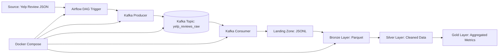

# Yelp Big Data Orchestration Project Pipeline

End-to-end **data engineering pipeline** built using **Apache Spark**, **Apache Airflow**, **Apache Kafka**, and Docker.

The project demonstrates a modern **Big Data pipeline** based on the **medallion architecture**:

```text
Landing → Bronze → Silver → Gold
```
The pipeline processes the Yelp Academic Dataset from Kaggle, specifically the file:
_yelp_academic_dataset_review.json_

The project is fully containerized and orchestrated with Apache Airflow.

### Architecture

The system is orchestrated using Apache Airflow and processes data using Apache Spark in a Dockerized environment.

The newest version of the project includes Apache Kafka as a queue/message broker between the raw data source and the Spark medallion pipeline.


Current data flow:
```text
Yelp JSON --> Kafka Producer --> Kafka Topic --> Kafka Consumer --> Landing Zone --> Bronze Layer --> Silver Layer --> Gold Layer
```
This design separates data ingestion from data transformation and makes the pipeline closer to real-world event-driven Big Data architectures.

### Tech Stack
- Apache Spark / PySpark
- Apache Airflow
- Apache Kafka
- Docker / Docker Compose
- Python
- Yelp Academic Dataset
- Parquet
- JSON / JSONL

## Data product

The main data product created by this pipeline is:

**Yelp Business Review Metrics**

This product is created in the Gold layer and contains aggregated review metrics for each Yelp business.

The product helps users understand business-level review performance by providing:

- average star rating per business
- number of reviews per business

The output dataset is stored in:

```text
data/gold
```
The dataset is saved in Parquet format and can be consumed by Spark, Python, or other analytical tools that support Parquet files.

## Data Quality Metrics

The pipeline defines Data Quality metrics to help users understand whether the data product can be trusted.

The metrics are calculated after each successful pipeline run.

| Metric name                     | Definition                                                               | Expected threshold | Update cadence     |
|---------------------------------|--------------------------------------------------------------------------|--------------------|--------------------|
| Bronze row count                | Number of records available in the Bronze layer                          | > 0                | Every pipeline run |
| Bronze review_id uniqueness     | Percentage of unique `review_id` values among non-null records in Bronze | > 99.5%            | Every pipeline run |
| Silver business_id completeness | Percentage of rows in Silver where `business_id` is not null             | > 99%              | Every pipeline run |
| Silver stars validity           | Percentage of rows in Silver where `stars` value is between 1 and 5      | 100%               | Every pipeline run |
| Gold avg_stars validity         | Percentage of rows in Gold where `avg_stars` value is between 1 and 5    | 100%               | Every pipeline run |

The current values of the metrics are calculated automatically by the pipeline and saved to:

```text
data/quality/data_quality_metrics.json
```

The metrics are calculated by the Spark job:
```text
spark_jobs/yelp_data_quality.py
```

In Airflow, the metrics are generated by the final task:
```text
data_quality_checks
```

## Data Product Contract

The repository contains a Data Product Contract that describes how the final data product can be understood, trusted and consumed by another user.

Contract file:

```text
contracts/data_product_contract.yaml
```

The contract includes:

- product name
- product owner and contact
- product purpose
- source data
- pipeline architecture
- output dataset location
- schema
- refresh frequency
- access method
- Data Quality metrics
- known limitations
- example usage

The main data product described by the contract is:
```text
Yelp Business Review Metrics
```
The product is stored in the Gold layer:
```text
data/gold
```
The current Data Quality results are generated after each pipeline run and stored in:
```text
data/quality/data_quality_metrics.json
```

### Pipeline description
The pipeline is executed by Apache Airflow and consists of the following stages:

```text
inject_raw_to_kafka --> consume_kafka_to_landing --> bronze_layer --> silver_layer -->gold_layer
```

## Queue-Based Ingestion

The project includes Apache Kafka as a queue system used while moving data from the raw source into the processing pipeline.

### Kafka Producer
The producer reads the source file:
_data/raw/yelp_academic_dataset_review.json_
and sends every review as a separate message to a Kafka topic.

Main script:
_spark_jobs/yelp_queue_ingestion.py_

Producer mode:
_python3 /app/spark_jobs/yelp_queue_ingestion.py produce <run_id>_

### Kafka Topic
The messages are sent to the Kafka topic:

**yelp_reviews_raw**

Kafka acts as a queue/message broker between the source file and the next stage of the pipeline.

### Kafka Consumer

The consumer reads messages from the Kafka topic and writes them into the landing zone:

_data/landing/reviews_from_kafka.jsonl_

Consumer mode:

**_python3 /app/spark_jobs/yelp_queue_ingestion.py consume <run_id>_**

The run_id is passed from Airflow, which allows each pipeline run to process only messages related to the current DAG execution.

### Landing Zone

The landing zone stores data consumed from Kafka before it is processed by Spark.

Output file:
_data/landing/reviews_from_kafka.jsonl_

This file becomes the input for the Bronze layer.

### Bronze Layer

The Bronze layer reads data from the landing zone:
_data/landing/reviews_from_kafka.jsonl_

and saves it in Parquet format:
**data/bronze**

The Bronze layer represents raw ingested data in an optimized columnar format.

Main actions:

- Read JSONL data from landing zone
- Optional deduplication by review_id
- Save data as Parquet

### Silver Layer

The Silver layer reads data from Bronze and performs basic cleaning and standardization.

Main actions:

- Select relevant columns
- Cast data types
- Filter invalid rows
- Save cleaned data as Parquet

Selected columns example:

- business_id
- stars
- useful
- funny
- cool

Output path:
**data/silver**

### Gold Layer

The Gold layer reads data from Silver and creates analytical aggregations.

Main metrics:

- Average rating per business
- Review count per business

Output path:
**data/gold**

Example output columns:

- business_id
- avg_stars
- review_count

### How to run

docker compose up --build

Open Airflow UI:
http://localhost:8080

Login:
airflow
airflow

Choose 'yelp_medallion_pipeline' in the DAGs on the Airflow site

Press Trigger DAG

Airflow will automatically run the whole pipeline:

Raw Yelp JSON --> Kafka --> Landing --> Bronze --> Silver --> Gold

## Idempotency

The pipeline is designed to be rerunnable.

Current approach:

- Airflow triggers each stage in a controlled order.
- Kafka messages are tagged with a run_id.
- The consumer processes messages only for the current Airflow run.
- The landing file is written through a temporary file and then replaced.
- Spark layers are saved using overwrite mode.

This makes repeated runs predictable during development and testing.

### Key Concepts Demonstrated
- Workflow orchestration with Apache Airflow
- Queue-based ingestion with Apache Kafka
- Distributed data processing with Apache Spark
- Dockerized Big Data environment
- Medallion architecture
- Batch data processing
- Automated data injection from source
- Separation of ingestion and transformation
- Idempotent pipeline execution
- Parquet-based analytical storage